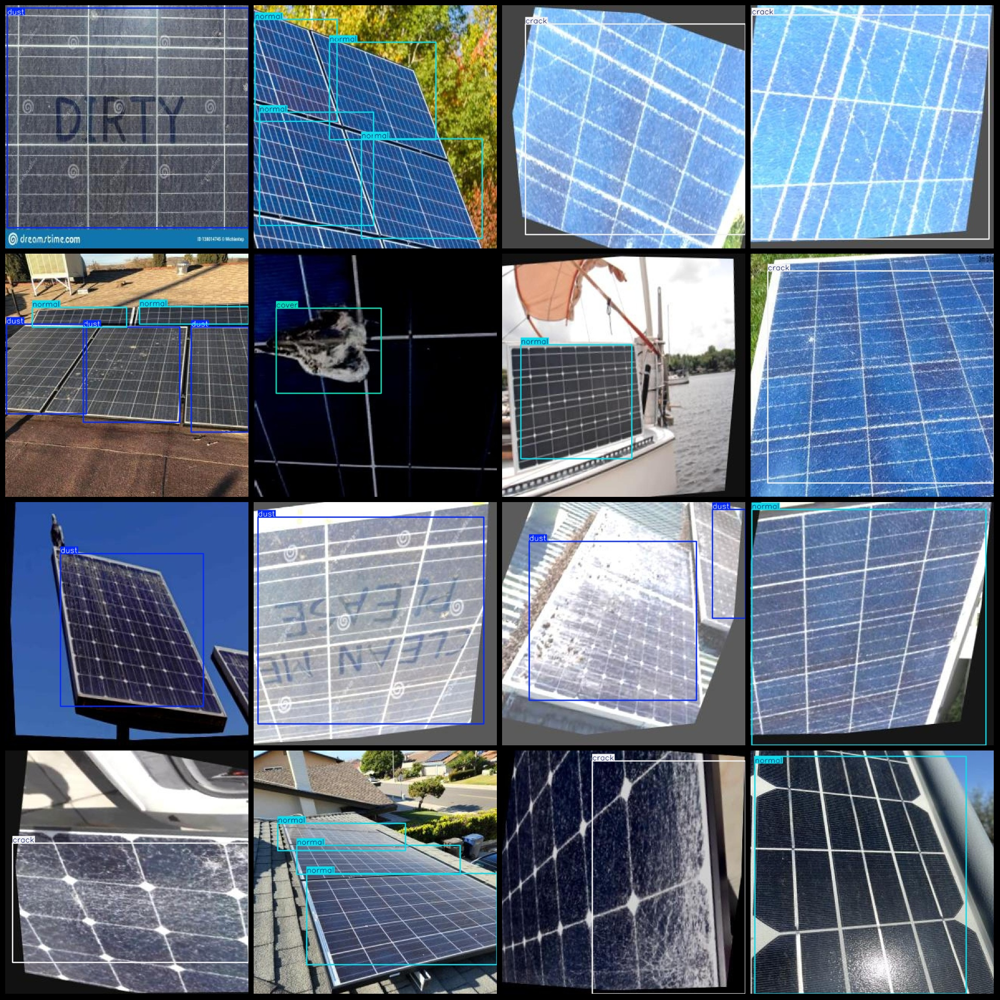
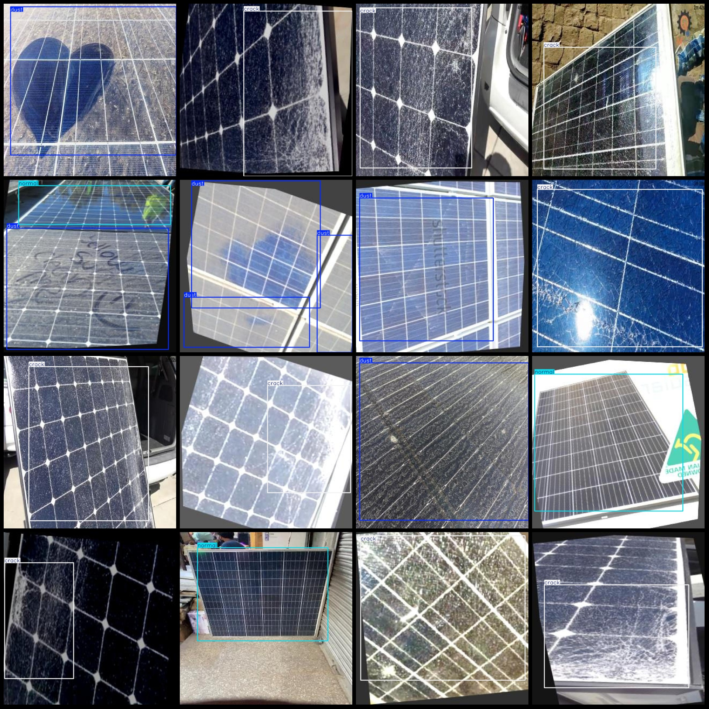

# Solar Panel Photo Defect Detection Dataset (VOC+YOLO) - 719 Images in 4 Categories

Dataset format: Pascal VOC format + YOLO format (txt file without split path, only containing jpg images along with corresponding VOC format xml files and YOLO format txt files).
Number of images (jpg file count): 719
Number of annotations (xml file count): 719
Number of annotations (txt file count): 719
Number of annotation categories: 4
Annotation category names (note that the order of categories in YOLO format does not correspond to this, but is based on the labels folder's classes.txt): ["cover", "crack", "dust", "normal"]
Box counts for each category:
- cover (coverage/protective cover) = 99 boxes
- crack (cracks) = 379 boxes
- dust (dust) = 434 boxes
- normal (normal) = 293 boxes
Total box count: 1205
Images per category:
- cover (coverage/protective cover) = 47 images
- crack (cracks) = 323 images
- dust (dust) = 221 images
- normal (normal) = 165 images
Image resolution: 640x640
Annotation tool used: labelImg
Annotation rules: Draw a bounding box around the category
Important notice: The dataset does not have a separate training, validation, or test set; you need to divide it yourself.
Special declaration: This dataset does not guarantee any accuracy of the trained models or weight files.
Image previews:
Annotation examples:

## Images

Here is a pay link on Stripe ( https://buy.stripe.com/3cs8yP7sY87d0vu9AB ). Please contact me lonlonago@foxmail.com after funding $89, and I will send you a complete data files , thank you!

